# DriST

## DriST Dataset
The DriST codebase for extracting road scene spatial-relationship triplets and generating the DriST dataset is available at [https://anonymous.4open.science/r/LLM_SRP/README.md](https://anonymous.4open.science/r/LLM_SRP/README.md).

## Evaluation of VLMs
The evaluation of different VLMs with the 4 query modes presented in the paper is available at [https://anonymous.4open.science/r/LLM_benchmark/README.md](https://anonymous.4open.science/r/LLM_benchmark/README.md).

## Monitor using VLM
The monitor implementations using the best performing VLM with query mode 4 is available at [https://anonymous.4open.science/r/LLM_SRP/monitor/README.md](https://anonymous.4open.science/r/LLM_SRP/monitor/README.md)

## Appendix
### Query modes
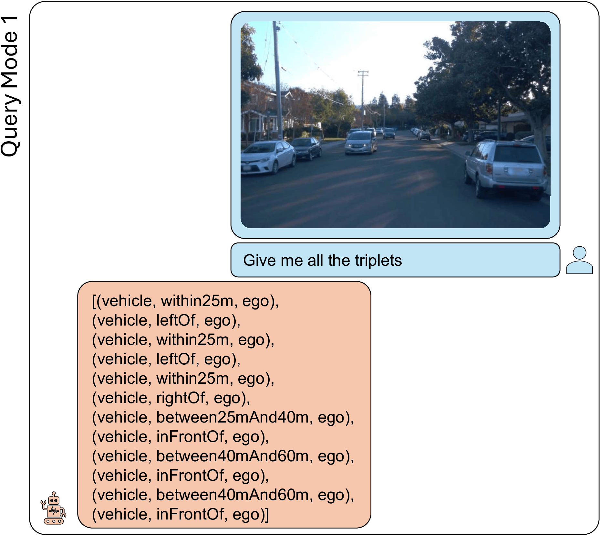
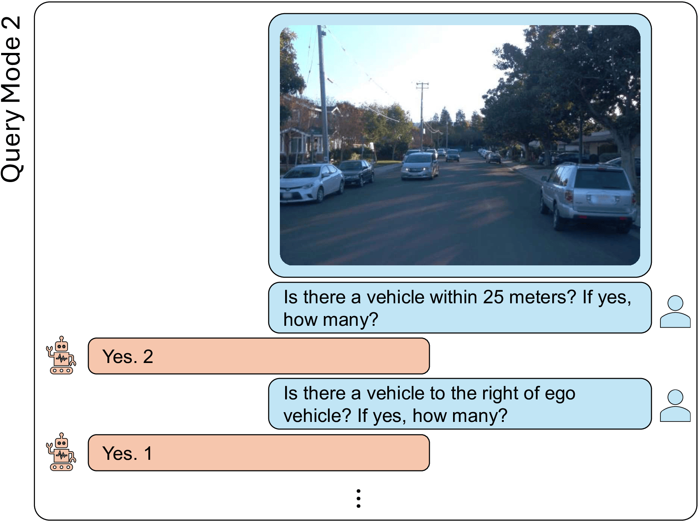
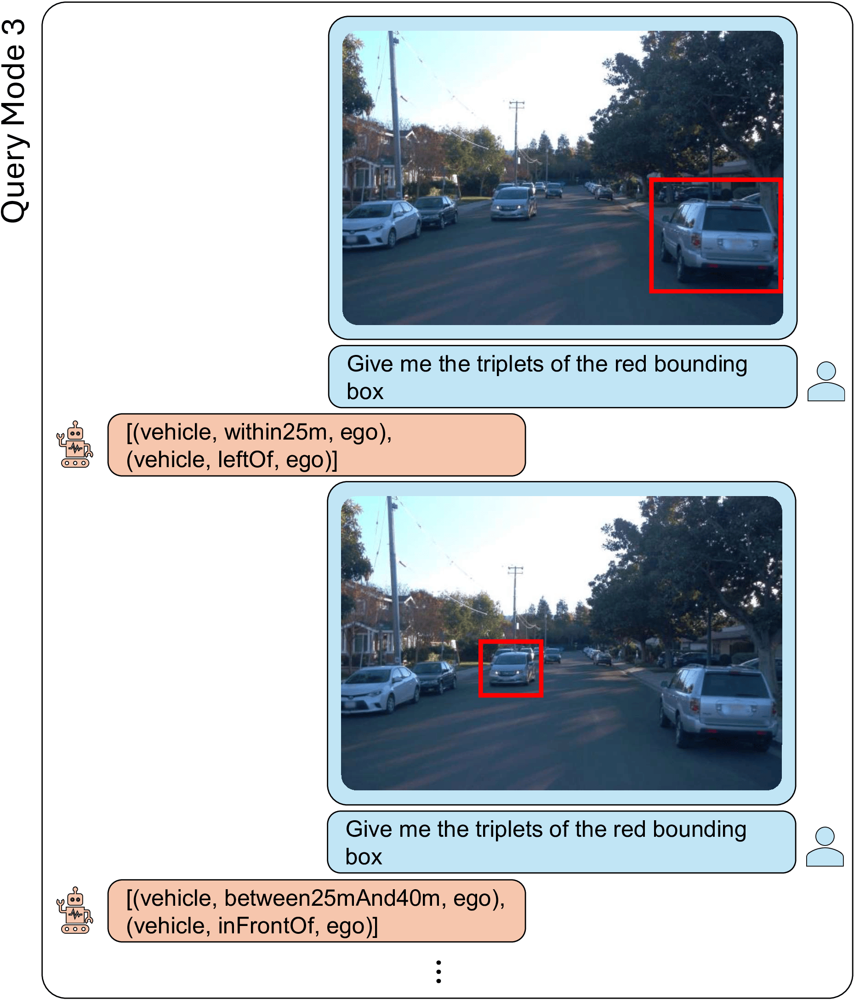
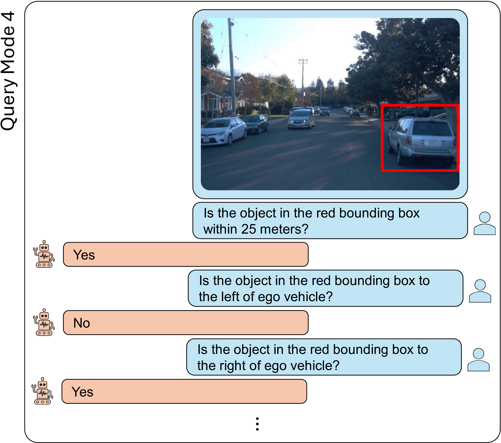

### Heatmaps
A value of -1 in the precision or recall heatmap indicates that there was no prediction or ground truth value for that triplet (denoted by a 0 in square brackets), respectively.
Conversely, a value of 0 in the precision or recall heatmap means that the VLM either never correctly identified the entity or missed all instances of it, respectively.

Figures [1](#fig1),[2](#fig2), [3](#fig3), and [4](#fig4) show the precision and recall heatmaps for LlaVA 1.5 fine-tuned using the different query modes.
In query mode 1 ([Fig. 1](#fig1)),  we observe that while the model achieves decent precision, its recall is particularly low for bicycles and persons.
This means that when the model predicts the presence of a bicycle or a person, it is correct most of the time (high precision); however, it fails to detect many instances of these entities (low recall).
In query mode 2 ([Fig. 2](#fig2)), most values improve, but the recall for bicycles and persons remains low.
In query mode 3 ([Fig. 3](#fig3)), with the addition of bounding boxes, there is a notable improvement in recall for persons, but a decrease in precision for bicycles.
This is likely due to mispredictions between similar entities—for example, confusing motorcycles with bicycles. 
Bicycles are relatively rare in the dataset, causing the model to struggle with accurately identifying them.
Finally in query mode 4 ([Fig. 4](#fig4)), the combination of bounding boxes and entity types enables the model to successfully determine the relative position and distance to the entity in most cases.

<figure id="fig1">
  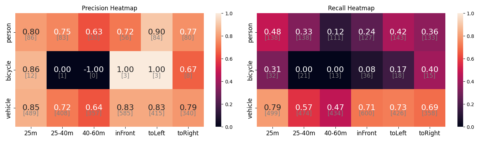
  <figcaption>Figure 1: Llava 1.5 ft heatmap for query mode 1</figcaption>
</figure>
<figure id="fig2">
  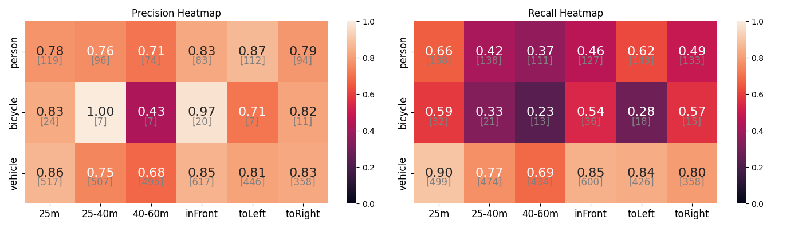
  <figcaption>Figure 2: Llava 1.5 ft heatmap for query mode 2</figcaption>
</figure>
<figure id="fig3">
  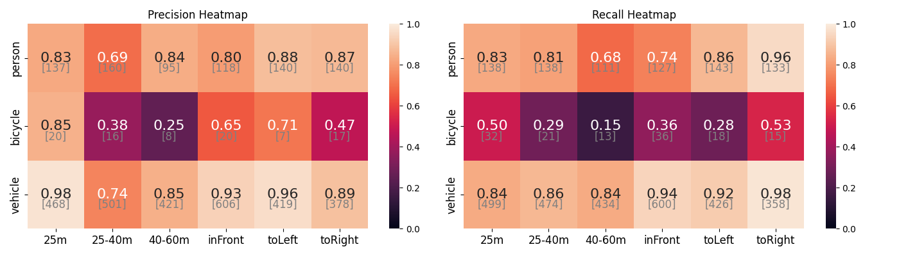
  <figcaption>Figure 3: Llava 1.5 ft heatmap for query mode 3</figcaption>
</figure>
<figure id="fig4">
  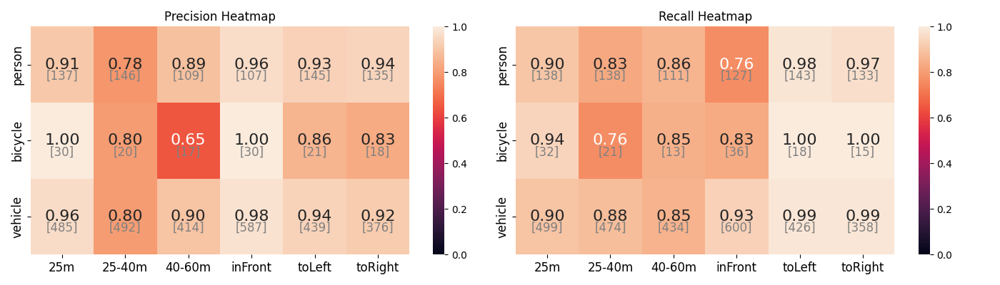
  <figcaption>Figure 4: Llava 1.5 ft heatmap for query mode 4</figcaption>
</figure>

Figures [5](#fig5),[6](#fig6), [7](#fig7), and [8](#fig8) show the precision and recall heatmaps for GPT 4 Turbo using the different query modes.
By looking the recall heatmaps across the different query modes, we can observe that GPT 4 struggled identifying entities farther than 25 meters.
In query mode 2 ([Fig 6](#fig6)) the recall for entities farther than 25 meters improved, but the precision for those same triplets is not high, meaning that the VLM is likely outputing 'yes' to many of the questions, and thus it does not misses triplets but it is not precise.
Adding bounding boxes, in query mode 3 and 4 ([Fig 7](#fig7) and [Fig 8](#fig8)), did not show significant recall improvements for detecting distance relationships, but slightly improved the detecting of position relationships.

<figure id="fig5">
  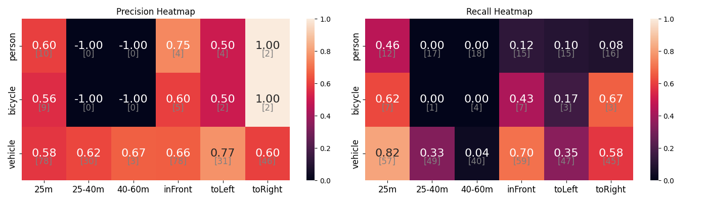
  <figcaption>Figure 1: GPT 4 heatmap for query mode 1</figcaption>
</figure>
<figure id="fig6">
  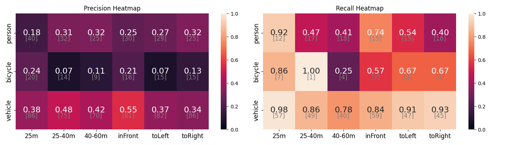
  <figcaption>Figure 2: GPT 4 heatmap for query mode 2</figcaption>
</figure>
<figure id="fig7">
  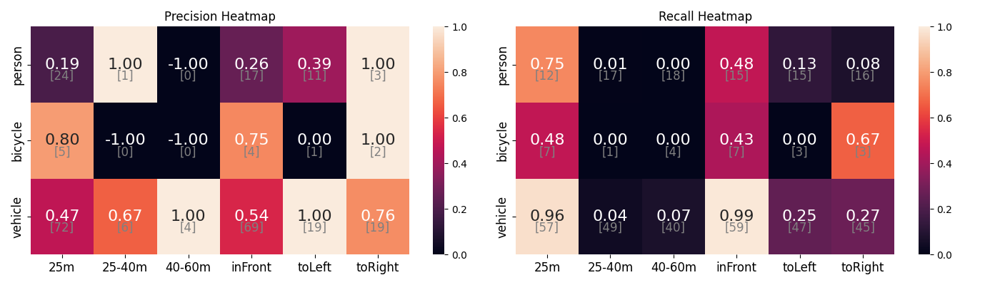
  <figcaption>Figure 3: GPT 4 heatmap for query mode 3</figcaption>
</figure>
<figure id="fig8">
  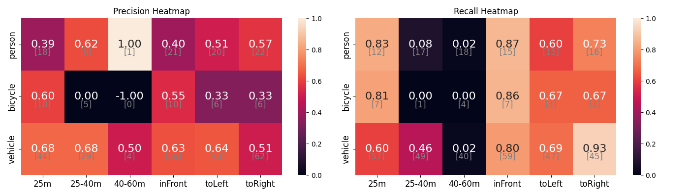
  <figcaption>Figure 4: GPT 4 heatmap for query mode 4</figcaption>
</figure>

### Extended study results

The following table shows the Precision (P), Recall (R), and F1 for each model, query mode (QM) and dataset.
The LlaVA 1.5 fine-tuned (ft) and LoRA (L) are the best performing models across the different query modes, showing the effectiveness of the DriST dataset, as a mean of enhancing VLMs capabilities to capture spatial relationships for driving scenarios. 
By taking a closer look at the precision and recall values, we can see that models like LlaVA 1.5, PaliGemma, and SpaceLlaVA, in query mode 4, achieve 100% recall; however, their precision is very low.
This is because these models answer 'yes' to all yes/no questions, ensuring no triplet is missed but resulting in high imprecision.

| Model      | QM | Time   | Total R | Total P | Total F1 | Kitti R | Kitti P | Kitti F1 | Waymo R | Waymo P | Waymo F1 | nuScenes R | nuScenes P | nuScenes F1 |
|------------|----|--------|---------|---------|----------|---------|---------|----------|---------|---------|----------|------------|------------|-------------|
| C-Llama3   | 1  | 15.29  | 0.44    | 0.15    | 0.19     | 0.44    | 0.11    | 0.15     | 0.42    | 0.15    | 0.18     | 0.46       | 0.20       | 0.23        |
| C-Phi3     | 1  | 9.85   | 0.57    | 0.19    | 0.26     | 0.65    | 0.23    | 0.31     | 0.55    | 0.20    | 0.26     | 0.49       | 0.16       | 0.21        |
| GPT-4-T    | 1  | 5.89   | 0.42    | 0.60    | 0.45     | 0.38    | 0.68    | 0.45     | 0.35    | 0.54    | 0.37     | 0.53       | 0.57       | 0.53        |
| L1.5       | 1  | 3.95   | 0.44    | 0.36    | 0.36     | 0.50    | 0.47    | 0.44     | 0.40    | 0.39    | 0.35     | 0.42       | 0.24       | 0.28        |
| L1.5-FT    | 1  | 2.57   | 0.63    | 0.76    | **0.66** | 0.69    | 0.83    | 0.72     | 0.61    | 0.81    | **0.67** | 0.59       | 0.64       | **0.59**    |
| L1.5-L     | 1  | 2.58   | 0.62    | 0.74    | 0.65     | 0.68    | 0.85    | **0.73** | 0.62    | 0.80    | 0.66     | 0.56       | 0.59       | 0.55        |
| L1.6-Mis   | 1  | 3.15   | 0.36    | 0.46    | 0.36     | 0.32    | 0.51    | 0.35     | 0.37    | 0.49    | 0.38     | 0.38       | 0.38       | 0.35        |
| L1.6-Vic   | 1  | 3.65   | 0.28    | 0.27    | 0.25     | 0.29    | 0.27    | 0.26     | 0.30    | 0.29    | 0.27     | 0.24       | 0.23       | 0.23        |
| PaliGemma  | 1  | 1.02   | 0.29    | 0.52    | 0.33     | 0.32    | 0.62    | 0.38     | 0.26    | 0.56    | 0.32     | 0.30       | 0.37       | 0.30        |
| RS2V       | 1  | 0.05   | 0.40    | 0.24    | 0.27     | 0.00    | 0.00    | 0.00     | 0.53    | 0.26    | 0.31     | 0.66       | 0.47       | 0.51        |
| SpaceLlaVA | 1  | 11.16  | 0.42    | 0.29    | 0.29     | 0.51    | 0.40    | 0.39     | 0.37    | 0.23    | 0.24     | 0.37       | 0.23       | 0.25        |
| C-Llama3   | 2  | 8.71   | 0.66    | 0.53    | 0.54     | 0.67    | 0.56    | 0.55     | 0.64    | 0.56    | 0.56     | 0.67       | 0.45       | 0.51        |
| C-Phi3     | 2  | 8.20   | 0.64    | 0.51    | 0.52     | 0.63    | 0.53    | 0.51     | 0.64    | 0.57    | 0.56     | 0.65       | 0.44       | 0.49        |
| GPT-4-T    | 2  | 108.81 | 0.71    | 0.34    | 0.42     | 0.80    | 0.37    | 0.46     | 0.68    | 0.37    | 0.44     | 0.64       | 0.30       | 0.37        |
| L1.5       | 2  | 5.13   | 0.46    | 0.52    | 0.45     | 0.45    | 0.56    | 0.44     | 0.43    | 0.57    | 0.46     | 0.50       | 0.44       | 0.44        |
| L1.5-FT    | 2  | 4.81   | 0.73    | 0.78    | **0.74** | 0.84    | 0.87    | **0.84** | 0.73    | 0.80    | **0.74** | 0.63       | 0.69       | **0.64**    |
| L1.5-L     | 2  | 4.84   | 0.64    | 0.75    | 0.67     | 0.65    | 0.81    | 0.69     | 0.66    | 0.79    | 0.69     | 0.62       | 0.66       | 0.61        |
| L1.6-Mis   | 2  | 8.93   | 0.58    | 0.52    | 0.50     | 0.57    | 0.51    | 0.47     | 0.53    | 0.59    | 0.52     | 0.63       | 0.45       | 0.49        |
| L1.6-Vic   | 2  | 8.25   | 0.46    | 0.51    | 0.45     | 0.42    | 0.36    | 0.35     | 0.44    | 0.62    | 0.48     | 0.51       | 0.56       | 0.50        |
| PaliGemma  | 2  | 1.69   | 0.69    | 0.19    | 0.27     | 0.75    | 0.22    | 0.31     | 0.65    | 0.24    | 0.32     | 0.68       | 0.12       | 0.20        |
| SpaceLlaVA | 2  | 14.44  | 0.54    | 0.41    | 0.42     | 0.59    | 0.44    | 0.44     | 0.51    | 0.51    | 0.47     | 0.53       | 0.28       | 0.34        |
| C-Llama3   | 3  | 4.59   | 0.47    | 0.47    | 0.47     | 0.45    | 0.45    | 0.45     | 0.40    | 0.40    | 0.40     | 0.55       | 0.55       | 0.55        |
| C-Phi3     | 3  | 4.01   | 0.45    | 0.45    | 0.45     | 0.42    | 0.42    | 0.42     | 0.37    | 0.37    | 0.37     | 0.56       | 0.56       | 0.56        |
| GPT-4-T    | 3  | 27.63  | 0.52    | 0.52    | 0.52     | 0.49    | 0.49    | 0.49     | 0.38    | 0.38    | 0.38     | 0.71       | 0.71       | 0.71        |
| L1.5       | 3  | 9.58   | 0.58    | 0.37    | 0.42     | 0.60    | 0.34    | 0.40     | 0.53    | 0.31    | 0.35     | 0.59       | 0.47       | 0.50        |
| L1.5-FT    | 3  | 4.30   | 0.89    | 0.89    | 0.89     | 0.87    | 0.87    | 0.87     | 0.90    | 0.90    | **0.90** | 0.88       | 0.88       | 0.88        |
| L1.5-L     | 3  | 4.35   | 0.90    | 0.90    | **0.90** | 0.89    | 0.89    | **0.89** | 0.90    | 0.90    | 0.90     | 0.92       | 0.92       | **0.92**    |
| L1.6-Mis   | 3  | 5.31   | 0.45    | 0.45    | 0.45     | 0.44    | 0.44    | 0.44     | 0.39    | 0.39    | 0.39     | 0.53       | 0.53       | 0.53        |
| L1.6-Vic   | 3  | 5.60   | 0.39    | 0.38    | 0.38     | 0.29    | 0.29    | 0.29     | 0.38    | 0.33    | 0.34     | 0.50       | 0.51       | 0.50        |
| PaliGemma  | 3  | 2.82   | 0.39    | 0.40    | 0.39     | 0.34    | 0.36    | 0.35     | 0.36    | 0.37    | 0.36     | 0.47       | 0.48       | 0.47        |
| SpaceLlaVA | 3  | 9.39   | 0.31    | 0.29    | 0.30     | 0.27    | 0.25    | 0.26     | 0.32    | 0.30    | 0.30     | 0.33       | 0.33       | 0.33        |
| C-Llama3   | 4  | 10.20  | 0.53    | 0.55    | 0.50     | 0.75    | 0.59    | 0.63     | 0.24    | 0.40    | 0.27     | 0.60       | 0.65       | 0.59        |
| C-Phi3     | 4  | 9.19   | 0.21    | 0.39    | 0.25     | 0.12    | 0.40    | 0.17     | 0.18    | 0.25    | 0.19     | 0.34       | 0.53       | 0.37        |
| GPT-4-T    | 4  | 169.72 | 0.64    | 0.63    | 0.61     | 0.70    | 0.53    | 0.59     | 0.40    | 0.59    | 0.46     | 0.82       | 0.77       | 0.78        |
| L1.5       | 4  | 6.40   | 1.00    | 0.42    | 0.56     | 1.00    | 0.33    | 0.50     | 1.00    | 0.43    | 0.57     | 1.00       | 0.49       | 0.61        |
| L1.5-FT    | 4  | 5.42   | 0.93    | 0.93    | **0.93** | 0.93    | 0.93    | **0.93** | 0.93    | 0.92    | **0.93** | 0.93       | 0.93       | **0.93**    |
| L1.5-L     | 4  | 5.44   | 0.76    | 0.88    | 0.81     | 0.72    | 0.88    | 0.78     | 0.83    | 0.87    | 0.84     | 0.73       | 0.89       | 0.79        |
| L1.6-Mis   | 4  | 26.91  | 0.76    | 0.43    | 0.52     | 0.67    | 0.37    | 0.45     | 0.66    | 0.44    | 0.51     | 0.96       | 0.49       | 0.61        |
| L1.6-Vic   | 4  | 9.72   | 0.84    | 0.45    | 0.55     | 0.93    | 0.35    | 0.50     | 0.72    | 0.48    | 0.54     | 0.87       | 0.53       | 0.63        |
| PaliGemma  | 4  | 2.30   | 1.00    | 0.42    | 0.56     | 1.00    | 0.33    | 0.50     | 1.00    | 0.43    | 0.57     | 1.00       | 0.49       | 0.61        |
| SpaceLlaVA | 4  | 28.72  | 1.00    | 0.42    | 0.56     | 1.00    | 0.33    | 0.50     | 1.00    | 0.43    | 0.57     | 1.00       | 0.49       | 0.61        |

**Table 1:** Performance of different VLMs using the 4 different query modes.