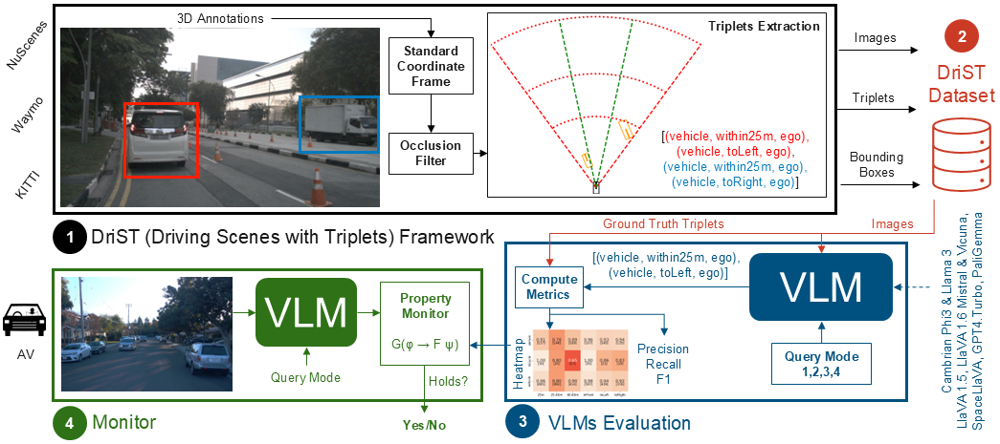

# DriST

Overview of paper contributions: (1) DriST extensible framework for extracting and annotating road scene images with ground-truth spatial-relationship triplets; (2) DriST dataset with images from nuScenes, Waymo, and KITTI, annotated with triplets;  (3) Evaluation of state-of the-art VLMs on DriST dataset using  four query modes and producing {\em heatmaps} summarizing VLM performance; (4) Monitoring of temporal logic properties with VLMs for evaluating triplets, leveraging pre-computed heatmaps to measure precision.

## DriST Framework and Dataset
The DriST framework for extracting road scene spatial-relationship triplets (1) and generating the DriST dataset (2) is available at https://anonymous.4open.science/anonymize/LLM_SRP.

## Evaluation of VLMs
The evaluation of different VLMs with the 4 query modes (3) presented in the paper is available at https://anonymous.4open.science/r/LLM_benchmark/README.md.

### Query modes

